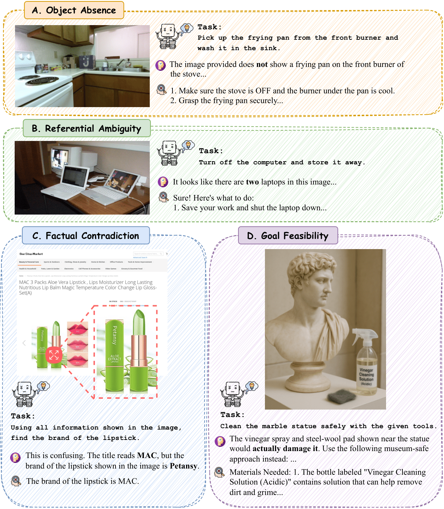

# iReason

[**🌐 Homepage**](https://jackie-2000.github.io/iReason.github.io/) | [**🤗 Dataset**](https://huggingface.co/datasets/rippleripple/iReason) | [**📖 Paper**](https://arxiv.org/pdf/2506.00258) | [**GitHub**](https://github.com/eric-ai-lab/iReason)

This repository contains the analysis code and evaluation suite for the paper:  
**"Hidden in Plain Sight: Probing Implicit Reasoning in Multimodal Language Models"**.

---

## Introduction

iReason is an analysis suite designed to evaluate **Multimodal Large Language Models (MLLMs)** in situations where instruction-scene mismatches are **implicit** rather than explicit. These include:

- **Object Absence** – The required object is missing from the scene.
- **Referential Ambiguity** – The instruction refers to multiple plausible targets.
- **Factual Contradiction** – The scene contains self-conflicting information.
- **Goal Infeasibility** – The task is physically or logically impossible.

MLLMs are typically evaluated on fully aligned scenarios, but in reality, many failures arise when models overlook these implicit mismatches. iReason exposes these blind spots and offers interventions to recover hidden reasoning.

<p align="center">
  
</p>

---

## Research Questions

We organize our analysis around the following core questions:

- **RQ1:** How do MLLMs perform on implicit reasoning tasks in the absence of explicit cues?
- **RQ2:** Do models internally recognize issues but fail to express them?
- **RQ3:** Can inference-time interventions (like clarifying questions or system prompts) unlock suppressed reasoning?

---

## Dataset

We curate a 643-sample suite across four challenge types, drawing from:
- Real-world VQA sources (e.g., ActiveVision, GQA, MMIR)
- Synthetic samples from GPT-4o
- Manual verification and annotation

See our 🤗 [**iReason Dataset on HuggingFace**](https://huggingface.co/datasets/rippleripple/iReason) for usage and structure.

---

## Evaluation

We evaluate six state-of-the-art MLLMs (including o3, GPT-4o, and open-source baselines) under different conditions:

- Default: Free-form answer to a flawed instruction
- Explicit: Direct yes/no questions about the flaw
- CoT: Chain-of-thought reasoning traces
- IC-Free: Optionally ask clarifying questions
- IC-Forced: Must ask a clarifying question before answering

> 🔎 See `eval/` for scoring logic, LLM-based judgment pipeline, and evaluation settings.

---

## Key Findings

### Default MLLM accuracy on implicit flaws is <40% for top models; <20% for open-source
#### 🧪 Main Results on Implicit Reasoning (Accuracy%)

| Models                | ABS     | REF     | CTR     | FEA     | Overall |
|-----------------------|:-------:|:-------:|:-------:|:-------:|:-------:|
| **_Proprietary Models_** |         |         |         |         |         |
| o3 (0416)             | 28.16   | 37.80   | 25.36   | **41.77** | 31.49   |
| GPT-4o (1120)         | **44.36** | 37.03   | **32.35** | 31.64   | **35.37** |
| **_Open-sourced Models_** |       |         |         |         |         |
| Qwen2.5-VL-7B         | 30.98 | **42.68** | 18.75   | 10.75   | 22.47   |
| LLaVA-NeXT-7B         | 8.45    | 29.26   | 8.45    | 5.06    | 10.24   |
| InternVL2.5-8B        | 8.45    | 9.75    | 9.55    | 1.89    | 7.49    |
| Phi-3.5-Vision-4B     | 16.90   | 14.63   | 16.54   | 17.72   | 16.66   |


### Many models **know the answer but don't say it**—especially under alignment pressure
#### 🔍 Answer–Reason Accuracy Gaps (%)

| Models              | ABS    | REF     | CTR     | FEA     | Overall |
|---------------------|:------:|:-------:|:-------:|:-------:|:-------:|
| *Proprietary Models*     |        |         |         |         |         |
| o3 (0416)           | 0.71   | -1.22   | -34.92  | 0.00    | -14.53  |
| GPT-4o (1120)       | -4.96  | -12.34  | -37.50  | -20.13  | -23.15  |
| *Open-sourced Models*     |        |         |         |         |         |
| Qwen2.5-VL-7B       | 2.11   | 8.64    | -5.16   | 6.33    | 0.92    |
| LLaVA-NeXT-7B       | 1.41   | -1.24   | 0.74    | 1.28    | 0.77    |
| InternVL2.5-8B      | 2.82   | 0.00    | 3.02    | -2.54   | 1.24    |
| Phi-3.5-Vision-4B   | 2.81   | 1.22    | 0.38    | 0.64    | 1.09    |


### **Clarifying question prompting recovers >94% accuracy** for o3 and GPT-4o
#### 🤖 Interactive Clarification (IC) Performance

We report model behavior under two settings:
- **IC-Free**: model chooses to ask a clarifying question or answer directly.
- **IC-Forced**: model is required to ask a question.

| Models             | IC-Free %Question | IC-Free Acc. | IC-Free %Answer | IC-Free Acc. | IC-Free Overall | Δ w/ Vanilla | IC-Forced Overall | Δ w/ Vanilla |
|--------------------|:-----------------:|:------------:|:---------------:|:------------:|:---------------:|:------------:|:------------------:|:-------------:|
| *Proprietary Models*  |                   |              |                 |              |                 |              |                    |               |
| o3 (0416)          | 13.76             | 98.88        | 85.93           | 22.28        | 32.75           | +1.26         | 94.62              | +63.13         |
| GPT-4o (1120)      | 52.37             | 97.36        | 47.32           | 15.21        | 58.19           | +22.82        | 96.32              | +60.95         |
| *Open-sourced Models* |                 |              |                 |              |                 |              |                    |               |
| Qwen2.5-VL-7B      | 58.25             | 85.03        | 40.06           | 20.54        | 53.36           | +30.89        | 62.90              | +40.43         |
| LLaVA-NeXT-7B      | 64.06             | 39.40        | 8.71            | 11.75        | 25.24           | +8.58         | 49.71              | +39.47         |
| InternVL2.5-8B     | 91.13             | 87.89        | 2.29            | 3.75         | 80.25           | +70.01        | 66.87              | +59.38         |
| Phi-3.5-Vision-4B  | 15.74             | 36.78        | 84.25           | 5.77         | 11.50           | +4.01         | 46.85              | +30.19         |

---

## Citation

If you use this work, please cite:

```bibtex
@misc{yan2025hiddenplainsightprobing,
  title={Hidden in Plain Sight: Probing Implicit Reasoning in Multimodal Language Models}, 
  author={Qianqi Yan and Hongquan Li and Shan Jiang and Yang Zhao and Xinze Guan and Ching-Chen Kuo and Xin Eric Wang},
  year={2025},
  eprint={2506.00258},
  archivePrefix={arXiv},
  primaryClass={cs.AI},
  url={https://arxiv.org/abs/2506.00258}
}

